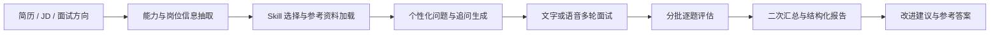
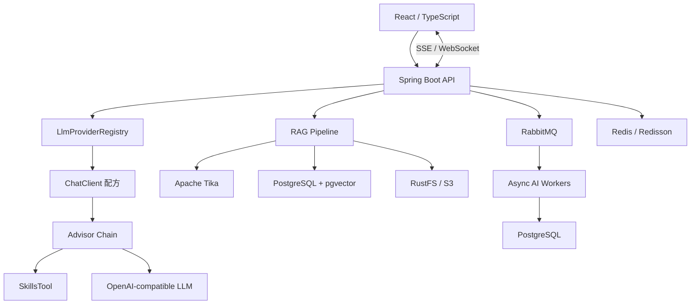
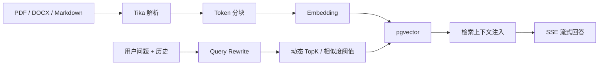
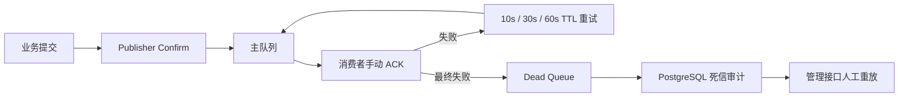

<div align="center">

# AI Interview Agent

**基于 Spring AI 的智能面试、RAG 与职业能力评估平台**

围绕简历理解、岗位分析、个性化出题、多轮面试、回答评估和知识问答，
构建覆盖模型调用、工具使用、上下文管理与长任务执行的完整 AI 工作流。

[](https://openjdk.org/)
[](https://spring.io/projects/spring-boot)
[](https://spring.io/projects/spring-ai)
[](https://react.dev/)
[](https://www.postgresql.org/)
[](https://www.rabbitmq.com/)
[](LICENSE)

</div>

---

## 项目概览

AI Interview Agent 面向求职训练场景，将用户简历、目标岗位、面试 Skill、专业参考资料与多轮会话组合为动态上下文，驱动大模型完成个性化出题、实时追问、逐题评价和综合报告生成。

项目不是单一聊天页面，而是一套可运行的 AI 应用工程：后端统一管理不同模型供应商，通过 Spring AI Advisor 和 Tool Calling 扩展模型能力，通过 pgvector 构建 RAG，通过结构化输出契约连接 LLM 与业务对象，并使用 RabbitMQ 保证耗时任务可靠执行。

### 核心能力

| 能力 | 实现 |
| --- | --- |
| Agent Workflow | 简历解析 → JD 识别 → Skill 选择 → 个性化出题 → 多轮面试 → 分批评估 → 报告汇总 |
| Tool Calling | Spring AI `ToolCallingAdvisor` + Agent Utils `SkillsTool` 动态加载面试技能 |
| 多模型路由 | 统一管理 DashScope、Kimi、DeepSeek、GLM、LM Studio 等 OpenAI 兼容 Provider |
| Prompt Engineering | StringTemplate 模板、动态上下文、数据边界、注入检测和任务级 Prompt 拆分 |
| Structured Output | JSON Schema 校验、DTO 映射、本地 JSON 修复、定向重试与 Micrometer 指标 |
| RAG | Apache Tika、Embedding、pgvector、Query Rewrite、动态 TopK/阈值和多轮上下文 |
| 可靠异步任务 | RabbitMQ 手动 ACK、Publisher Confirm、10/30/60 秒重试、幂等、死信审计与重放 |
| 实时语音 | WebSocket + ASR + LLM 流式输出 + 句子级并发 TTS |

## Agent 工作流



这是一套具备工具调用和工作流编排能力的单 Agent 系统。当前重点是可控的任务编排、上下文构建和业务可靠性，不将其包装为尚未实现的多 Agent 自主协作系统。

## 系统架构



## Agent 工程设计

### 1. 多模型接入与 ChatClient 配方

`LlmProviderRegistry` 将 Provider 配置、ChatModel、EmbeddingModel 和 ChatClient 创建逻辑集中管理，使业务 Service 不依赖具体模型厂商。配置更新后通过整体替换缓存容器实现线程安全的懒重建，避免旧 API Key、模型名或 Base URL 被在途线程写回新缓存。

根据任务约束创建三类 ChatClient：

| Client | Tools | Advisor | 场景 |
| --- | --- | --- | --- |
| Default | SkillsTool | Tool Calling、SafeGuard、可选 Memory/Logger | RAG、普通 Agent 调用 |
| Plain | 无 | SafeGuard | 出题、评分等严格 JSON 任务 |
| Voice | SkillsTool | 流式 Tool Calling、SafeGuard | 实时语音面试 |

结构化任务使用 Plain Client，避免工具调用消息破坏 JSON 输出；语音场景由业务层按 `sessionId` 管理历史，因此不依赖全局 Memory Advisor，降低会话串扰风险。

### 2. Skill 与 Tool Calling

项目内置 Java 后端、算法、系统设计、前端、Python、测试开发、AI Agent 及企业专项等面试 Skill。每个 Skill 使用 `SKILL.md`、元数据和 references 描述面试角色、考察范围、分类分配及参考知识。

Spring AI Agent Utils 的 `SkillsTool` 将这些资源暴露为 ToolCallback，`ToolCallingAdvisor` 管理模型请求、工具执行和结果回传。出题阶段还会根据岗位描述、难度、历史题目和题量要求动态组装 Skill 上下文。

### 3. Prompt 与结构化输出

简历分析、JD 分类、面试出题、逐题评估、报告汇总、知识库查询和 Query Rewrite 使用独立 StringTemplate 模板。System Prompt 固定角色、评分标准和行为边界，User Prompt 只承载本次业务数据。

`StructuredOutputInvoker` 统一处理：

- `BeanOutputConverter` 与 JSON Schema 校验；
- 模型输出到 Java DTO 的映射；
- 未转义引号的有限本地修复；
- 解析失败后的严格 JSON 定向重试；
- 调用次数、尝试次数和耗时指标；
- 达到最大次数后的统一业务异常。

外部简历和 JD 通过随机数据边界标签包装，并结合 `PromptSanitizer`、安全提示和 `SafeGuardAdvisor` 降低 Prompt Injection 风险。

### 4. RAG 知识库



短问题、中等问题和长问题使用不同 TopK 与相似度阈值。查询改写失败时回退原问题；改写结果没有有效召回时继续使用原问题检索；没有有效文档命中时直接返回证据不足，而不是要求模型编造答案。

### 5. Agent 长任务可靠性

简历分析、文字面试评估、语音面试评估和知识库向量化默认使用独立 RabbitMQ 拓扑。消息只携带业务 ID，不传输简历正文、音频或大段文档；消费者从 PostgreSQL 或 RustFS 按需加载数据。



每类任务均支持消费幂等、失败状态持久化、死信查询和人工重放。旧 Redis Stream 实现作为条件化适配器保留，可通过配置按模块回滚，但 Redis 主要继续承担缓存和限流职责。

## 功能模块

- **简历智能分析**：多格式解析、多维评分、项目经历审计、改进建议和 PDF 报告。
- **文字模拟面试**：Skill 驱动出题、简历定制题、历史去重、追问和异步评估。
- **实时语音面试**：WebSocket、实时字幕、上下文恢复、流式 LLM 和并发 TTS。
- **知识库问答**：多知识库会话、查询改写、向量检索、SSE 流式输出和 Markdown 展示。
- **面试安排**：邀请信息解析、日历视图、状态流转和提醒管理。
- **模型设置**：Provider 管理、默认 Chat/Embedding 模型切换、连通性检查和 API Key 加密。

## 技术选型

### 后端与 AI

| 技术 | 版本/用途 |
| --- | --- |
| Java / Spring Boot | Java 21、Spring Boot 4.1、虚拟线程 |
| Spring AI | 2.0，ChatClient、Advisor、Tool Calling、Structured Output |
| Spring AI Agent Utils | 0.10，SkillsTool |
| PostgreSQL + pgvector | 业务数据、向量存储、HNSW/COSINE 检索 |
| RabbitMQ | AI 长任务异步处理、延迟重试与死信 |
| Redis + Redisson | 缓存、限流和可回滚 Stream 适配器 |
| RustFS / S3 | 简历和知识库原始文件存储 |
| Apache Tika | PDF、DOC、DOCX、TXT、Markdown 解析 |
| Micrometer | 模型调用、结构化输出和语音链路指标 |
| JUnit 5 / Mockito / AssertJ | 单元测试与消息链路验证 |

### 前端

| 技术 | 用途 |
| --- | --- |
| React 18 / TypeScript | 页面与类型安全 |
| Vite / Tailwind CSS 4 | 构建与样式系统 |
| React Router | 页面路由 |
| Framer Motion | 交互动效 |
| Recharts | 评分与统计图表 |
| React Virtuoso | RAG 长会话虚拟列表 |

## 效果展示

### 面试中心与出题


### 简历分析与面试报告


### RAG 知识库


> 当前截图沿用项目已有资源。建议后续使用个人环境重新截图，以展示 RabbitMQ 管理台、Agent 配置页和最新界面。

## 项目结构

```text
InterviewGuide/
├── app/src/main/java/interview/guide/
│   ├── common/
│   │   ├── ai/                 # Provider Registry、Advisor、结构化输出、安全边界
│   │   ├── async/              # 可回滚的 Redis Stream 模板
│   │   └── evaluation/         # 文字/语音统一评估引擎
│   ├── infrastructure/         # Redis、文件存储、导出和对象映射
│   └── modules/
│       ├── resume/             # 简历解析与分析
│       ├── interview/          # 出题、Skill、文字面试和评估
│       ├── voiceinterview/     # 实时语音面试
│       ├── knowledgebase/      # RAG、向量化和会话管理
│       ├── interviewschedule/  # 面试安排
│       └── llmprovider/        # 模型配置管理
├── app/src/main/resources/
│   ├── prompts/                # StringTemplate Prompt
│   └── skills/                 # SKILL.md、元数据和 references
├── frontend/                   # React 前端
├── docker-compose.dev.yml      # 本地依赖环境
└── .env.example                # 环境变量示例
```

## 本地运行

推荐采用混合开发模式：PostgreSQL、Redis、RabbitMQ 和 RustFS 使用 Docker，前后端在本机运行，便于断点调试与热更新。

### 环境要求

- JDK 21
- Docker Desktop
- Node.js 20+
- pnpm 10+
- IntelliJ IDEA（推荐）

### 1. 克隆与配置

```powershell
git clone https://github.com/actionboy11/ai-interview-agent.git
cd ai-interview-agent
Copy-Item .env.example .env
```

至少填写：

```env
AI_BAILIAN_API_KEY=your_dashscope_api_key
APP_AI_CONFIG_ENCRYPTION_KEY=replace_with_a_random_long_secret

POSTGRES_PASSWORD=123456
APP_STORAGE_ACCESS_KEY=rustfsadmin
APP_STORAGE_SECRET_KEY=rustfsadmin
```

`.env` 已被 Git 忽略。Gradle `bootRun` 会从仓库根目录加载该文件，不要将真实 API Key 写入 `application.yml` 或提交到版本库。

### 2. 启动基础设施

```powershell
docker compose -f docker-compose.dev.yml up -d
docker compose -f docker-compose.dev.yml ps
```

| 服务 | 地址 | 默认账号 |
| --- | --- | --- |
| PostgreSQL | `localhost:5432` | `postgres / 123456` |
| Redis | `localhost:6379` | 无 |
| RabbitMQ | `localhost:5672` | `interview / interview` |
| RabbitMQ 管理台 | http://localhost:15672 | `interview / interview` |
| RustFS API | `localhost:9000` | `rustfsadmin / rustfsadmin` |
| RustFS 控制台 | http://localhost:9001 | `rustfsadmin / rustfsadmin` |

RustFS 首次启动后创建名为 `interview-guide` 的 Bucket；应用也配置了自动创建能力。

### 3. 启动后端

```powershell
.\gradlew.bat :app:bootRun
```

- API：http://localhost:8080
- Swagger：http://localhost:8080/swagger-ui.html
- Health：http://localhost:8080/actuator/health

也可以在 IDEA 中直接运行 `app/src/main/java/interview/guide/App.java`。使用 IDEA 启动时，需要在 Run Configuration 中加载 `.env` 对应变量。

### 4. 启动前端

```powershell
cd frontend
pnpm install
pnpm run dev
```

访问：http://localhost:5173

### 5. 验证构建

```powershell
.\gradlew.bat :app:test --no-daemon
cd frontend
pnpm run build
```

停止依赖但保留数据：

```powershell
docker compose -f docker-compose.dev.yml stop
```

> 谨慎使用 `docker compose -f docker-compose.dev.yml down -v`，该命令会删除数据库、消息和对象存储卷。

## RabbitMQ 任务拓扑

四类任务分别使用独立 Exchange、Queue、Routing Key、重试队列和死信队列：

| 任务 | 主队列 | 死信管理接口 |
| --- | --- | --- |
| 简历分析 | `resume.analysis.queue` | `/api/admin/resume-analysis/dead-letters` |
| 语音评估 | `voice.evaluation.queue` | `/api/admin/voice-evaluation/dead-letters` |
| 文字评估 | `interview.evaluation.queue` | `/api/admin/interview-evaluation/dead-letters` |
| 知识库向量化 | `knowledge.vectorization.queue` | `/api/admin/knowledge-vectorization/dead-letters` |

对应环境变量默认均为 `rabbitmq`：

```env
APP_RESUME_MESSAGING_PROVIDER=rabbitmq
APP_VOICE_EVALUATION_MESSAGING_PROVIDER=rabbitmq
APP_INTERVIEW_EVALUATION_MESSAGING_PROVIDER=rabbitmq
APP_KNOWLEDGE_VECTORIZATION_MESSAGING_PROVIDER=rabbitmq
```

将单个值改为 `redis-stream` 并重启后端，可对该模块独立回滚。

## 已知限制与 Roadmap

- 增加 Agent 轨迹记录与离线评测集，形成可重复的 Prompt/模型效果评估。
- 将面试 Agent 的阶段流转升级为显式状态机，增强可解释性和恢复能力。
- 打通知识库与模拟面试，让出题和参考答案可以按知识库动态增强。
- 探索 WebRTC、客户端 VAD 和端到端语音模型，降低语音链路延迟。
- 优化前端大 chunk 与部分 Tailwind 生成的 CSS 警告。

## 项目来源与开源说明

本项目基于 [Snailclimb/interview-guide](https://github.com/Snailclimb/interview-guide) 进行二次开发，并于 2026 年围绕 Spring AI Agent、Advisor、Tool Calling、RAG、多模型路由、结构化输出和 RabbitMQ 异步可靠性进行了扩展与重构。

感谢原项目作者及所有开源依赖的贡献。本项目继续按照 [GNU Affero General Public License v3.0](LICENSE) 发布；如通过网络向用户提供修改后的服务，请按照许可证要求提供对应源代码。

## License

[GNU Affero General Public License v3.0](LICENSE)
